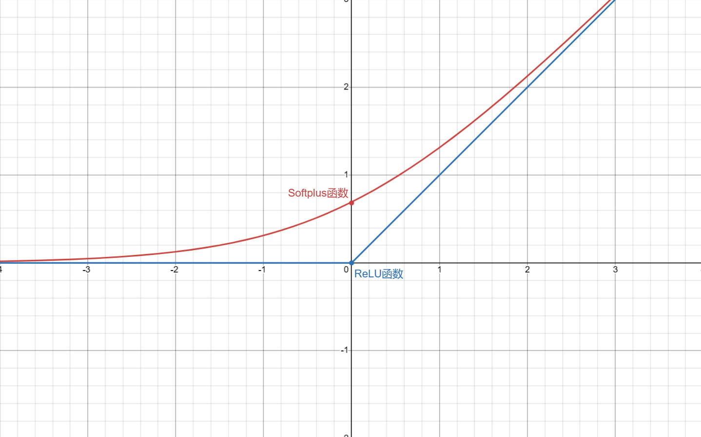

用神经网络对数据集进行拟合。

## 神经网络`Neural Network`
### 预处理层
在图像分类中，假如一张图片的像素数量为($224\times224\times3=150528$)，如果直接将所有像素作为输入层输入，那么隐藏层参数将爆炸式增长，而且

### 输入层

### 隐藏层

### 输出层

## 激活函数`Activation Function`
神经网络中的激活函数用于引入非线性因素，使得网络能够学习并表示各种复杂的函数。
### `ReLU(Rectified Linear Unit)`函数
$$
ReLU(x) = \max(0,x)
$$
用`ReLU`函数拟合出的函数图像都是折线。
#### 可能会导致神经元死亡问题`Dead Neurons`
在训练过程中某些神经元可能停止对任何输入做出反应的情况，这通常发生在使用ReLU激活函数的网络中。ReLU函数的特性是当输入小于0时，输出为0，其导数也为0。如果一个神经元的权重在训练初期就调整到使得输入总和为负（或在训练过程中调整到这种状态），那么它的输出和梯度将始终为0，导致该神经元不再学习，即“死亡”。
### `softplus`函数
$$
Softplus(x) = \ln(1+e^x)
$$
与`Relu`相似，但它在`x`为负值时也能提供一个非零的梯度，从而避免了 ReLU 中的“死神经元”问题。\
它的导数是`Sigmoid`函数。\

### `sigmoid`函数
$$
Sigmoid(x) = \frac{1}{1+e^{-x}}
$$
#### 可能会导致梯度消失`Vanishing Gradient`问题
当激活函数的导数非常小（接近于0）的时候，如果网络层较多，这些小的梯度在反向传播过程中会连乘，导致深层网络中靠近输入层的权重的梯度变得非常小。这使得网络权重难以更新，从而难以学习到有效的特征和表现，导致训练过程非常缓慢或者完全停滞。

## 损失函数`Loss Function`
损失函数（也称为成本函数）用于确定神经网络对数据的拟合程度，其值越小，表示模型拟合得越好。
### 残差平方和`Sum of Squared Residuals, SSR`
量化模型预测值与实际值之间的误差。
$$
SSR = \sum_{i=1}^{n}(y_{i}-\hat{y}_{i})^2
$$
### 交叉熵损失`Cross-Entropy Loss`
常用于二分类和多分类问题。\
二分类：
$$
-[y\ln(\hat{y})+(1-y)\ln(1-\hat{y})]
$$
多分类：
$$
-\sum_{i=1}^{C}y_i\ln(\hat{y}_i)
$$

## 通过计算或估计损失函数最小值点来优化参数
### 链式法则`Chain Rule`
通过链式法则计算损失函数的梯度计算最小值点来优化参数。
### 梯度下降法`Gradient Descent`
通常用在不可能解出梯度等于0的情况下
1. 对损失函数中的每个参数取导数，对损失函数取梯度
2. 先随机确定一个参数值代入梯度求出梯度值
3. 将求出的梯度值乘以一个小数学习率`lr(Learning Rate)`来确定步长
4. 通过旧参数值减去步长得到新参数值
5. 若步长小于事先定好的精度或者步数超出规定的最大步数，则结束计算，否则回到第1步继续计算

实际应用中一般使用随机梯度下降`SGD(Stochastic Gradient Descent)`，它在每一步中都使用数据集的一个随机选取的子集，减少了估计参数所用的时间。

## 反向传播`Backpropagation`
反向传播用以动态调整连接神经元之间的突触上的参数：权重`weights`和偏差`biases`。\
权重和偏差可以将神经网络中相同的激活函数切片、翻转并拉伸得到不同的形状，再将他们相加，最后将曲线移动得到一个新的函数。

## 多元输入输出的神经网络
输入样本数据集的多个属性值以及对应的类别，通过深度学习，捕捉特征，优化参数，得到一个多元输入输出的神经网络

## `SoftMax`函数
将多元输入输出的神经网络输出层的原始值转换为预测概率值
$$
p_{i}(z_1,z_2,...,z_K) = Softmax(z_i) = \frac{e^{z_i}}{\sum_{j=1}^{K}e^{z_j}}
$$
其中$p_i$是第`i`个输出节点的预测概率值，$z_i$是第`i`个输出节点的原始值，`K`是输出节点总数\
输出层的原始值会受到随机选择的参数初始值影响\
$p_i(z_1,z_2,...,z_K)$函数对$z_i$进行求导
$$
\frac{dp_i}{dz_i} = p_i(1-p_i)
$$
$p_i(z_1,z_2,...,z_K)$函数对$z_j(j\ne i)$进行求导
$$
\frac{dp_i}{dz_j} = -p_ip_j
$$

## 交叉熵`Cross Entropy`
二分类：
$$
-[y\ln(\hat{y})+(1-y)\ln(1-\hat{y})]
$$
多分类：
$$
-\sum_{i=1}^{C}y_i\ln(\hat{y}_i)
$$
其中`C`是类别数量，$y$是实际值，$\hat{y}$是预测值
