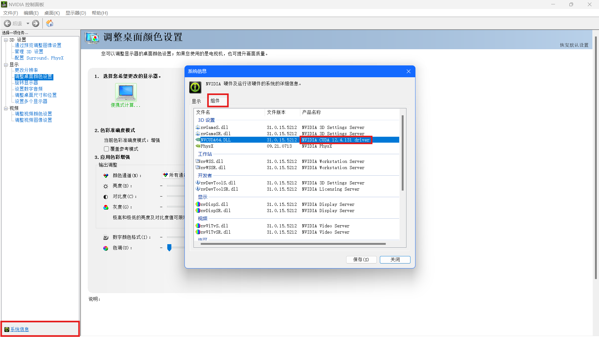

# 环境配置

## 1. 查看 GPU 支持的最高 CUDA 版本
NVDIA 控制面板 -> 左下角系统信息 -> 组件 -> NVCUDA64.DLL产品名称 \

选择`torch`版本时选择比该版本号低的版本

## 2. 下载 cuda
下载链接 [cuda 官网](https://developer.nvidia.com/cuda-downloads) \
\
`CUDA`是一个并行计算平台和编程模型，能够使得使用`GPU`进行通用计算变得简单和优雅。 \
\
`nvcc`其实就是`CUDA`的编译器,可以从`CUDA Toolkit`的`/bin`目录中获取,类似于`gcc`就是c语言的编译器。\
\
验证是否安装成功
分别运行
```shell
NVIDIA-smi
nvcc -V
```
分别返回版本号为
```
CUDA Version: 12.4
Build cuda_12.1.r12.1/compiler.32688072_0
```
原因：
因为`CUDA`有两种`API`，分别是运行时`API`和驱动`API`，即所谓的`Runtime API`与`Driver API`。\
\
`nvidia-smi`的结果除了有`GPU`驱动版本型号，还有`CUDA Driver API`的型号，这里是 11.0。\
\
而`nvcc`的结果是对应`CUDA Runtime API`（安装`python`包（例如`torch`）需要匹配`runtime cuda`版本）。

## 3. 下载 cudnn (CUDA Deep Neural Network library)
一个专门为深度学习计算设计的软件库，里面提供了很多专门的计算函数，如卷积等。 \
\
下载链接 [cudnn](https://developer.nvidia.com/rdp/cudnn-archive)，选择对应版本下载后，解压各个文件（bin、include、lib/x64）下的文件到路径C:\Program Files\NVIDIA GPU Computing Toolkit\CUDA\v12.1下的对应文件中去。

## 4. 下载 torch
下载链接 [torch 官网](https://pytorch.org/) \
如果包管理器使用的是清华源可能会下载到`cpu`版本的`torch`，会识别不到`cuda`\
运行
```
import torch
print(torch.__version__)
```
若返回的版本号带有`cpu`则表示版本错误，若带有`cu121`则表示成功

## 5. 验证
运行
```
import torch
print(torch.__version__)
print(torch.version.cuda)
print(torch.cuda.is_available())
print(torch.backends.cudnn.version())
```
返回
```
2.2.2+cu121 / torch 版本
12.1        / cuda 版本
True        / 判断 GPU 是否可用
8801        / NVIDIA cuDNN 版本 8.8.01
```
