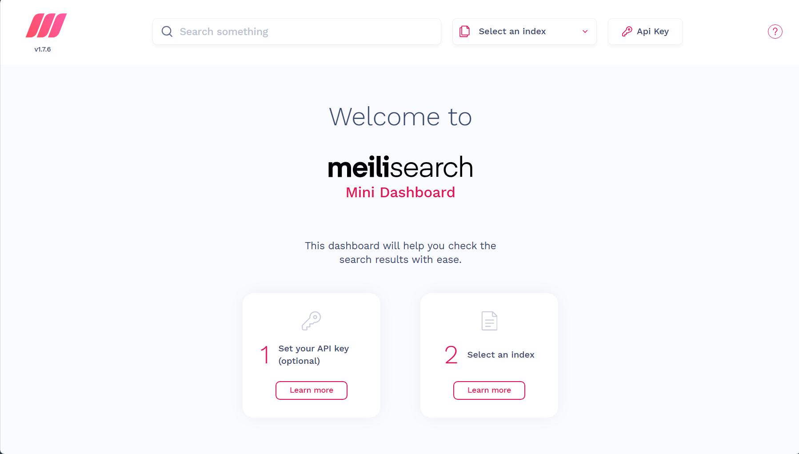

# 配置 MeiliSearch
## 1. 拉取 MeiliSearch 镜像
```sh
docker pull getmeili/meilisearch:latest
```
## 2. 运行镜像，生成容器
```sh
docker run -d --name meilisearch \
  -p 7700:7700 \
  -v /etc/meili_data:/meili_data \
  getmeili/meilisearch:latest \
  meilisearch --master-key="MASTER_KEY"
```
运行镜像时可以指定 `MASTER_KEY`，若未指定将生成一个 `MASTER_KEY`
## 3. 进入 MeiliSearch Mini Dashboard 验证是否成功
在浏览器中输入 IP:7700，出现以下页面表示成功：\

## 4. 使用 CURL 命令获取两个 key
运行
```sh
curl \
  -X GET 'http://localhost:7700/keys' \
  -H "Authorization: Bearer MASTER_KEY"
```
将返回一段 `json` 数据：
```json
{
  "results": [
    {
      "name": "Default Search API Key",
      "description": "Use it to search from the frontend",
      "key": "********",
      "uid": "********",
      "actions": [
        "search"
      ],
      "indexes": [
        "*"
      ],
      "expiresAt": null,
      "createdAt": "2024-04-13T15:41:30.75751833Z",
      "updatedAt": "2024-04-13T15:41:30.75751833Z"
    },
    {
      "name": "Default Admin API Key",
      "description": "Use it for anything that is not a search operation. Caution! Do not expose it on a public frontend",
      "key": "********",
      "uid": "********",
      "actions": [
        "*"
      ],
      "indexes": [
        "*"
      ],
      "expiresAt": null,
      "createdAt": "2024-04-13T15:41:30.754807998Z",
      "updatedAt": "2024-04-13T15:41:30.754807998Z"
    }
  ],
  "offset": 0,
  "limit": 20,
  "total": 2
}
```
## 5. 回到 dashboard，输入 Default Admin API Key
点击右上角 `Api Key`，输入 `Default Admin API Key`。
## 6. 操作索引 (index)
### creat index
运行
```sh
curl \
  -X POST 'http://localhost:7700/indexes' \
  -H 'Content-Type: application/json' \
  -H 'Authorization: Bearer MASTER_KEY' \
  --data-binary '{
    "uid": "blog",
    "primaryKey": "id"
  }'
```
返回
```json
{
  "taskUid": 0,
  "indexUid": "blog",
  "status": "enqueued",
  "type": "indexCreation",
  "enqueuedAt": "2024-04-14T03:56:37.113481034Z"
}
```
### get index
运行
```shell
curl \
  -X GET 'http://localhost:7700/indexes/blog' \
  -H 'Authorization: Bearer MASTER_KEY'
```
返回
```json
{
  "uid": "blog",
  "createdAt": "2024-04-14T03:56:37.125136421Z",
  "updatedAt": "2024-04-14T03:56:37.125136421Z",
  "primaryKey": null
}
```
其中未指定 `primaryKey` 时，不会自动生成，默认值为 `null`。
### list index
运行
```shell
curl \
  -X GET 'http://localhost:7700/indexes?limit=3' \
  -H 'Authorization: Bearer MASTER_KEY'
```
返回
```json
{
  "results": [
    {
      "uid": "blog",
      "createdAt": "2024-04-14T03:56:37.125136421Z",
      "updatedAt": "2024-04-14T04:10:08.434810983Z",
      "primaryKey": "123"
    }
  ],
  "offset": 0,
  "limit": 3,
  "total": 1
}
```
### update index
运行
```shell
curl \
  -X PATCH 'http://localhost:7700/indexes/blog' \
  -H 'Content-Type: application/json' \
  -H 'Authorization: Bearer MASTER_KEY' \
  --data-binary '{ "primaryKey": "123" }'
```
返回
```json
{
  "taskUid": 1,
  "indexUid": "blog",
  "status": "enqueued",
  "type": "indexUpdate",
  "enqueuedAt": "2024-04-14T04:10:08.430973479Z"
}
```
查看 `blog` 索引
```json
{
  "uid": "blog",
  "createdAt": "2024-04-14T03:56:37.125136421Z",
  "updatedAt": "2024-04-14T04:10:08.434810983Z",
  "primaryKey": "123"
}
```
更新成功
### delete index
运行
```shell
curl \
  -X DELETE 'http://localhost:7700/indexes/blog' \
  -H 'Authorization: Bearer MASTER_KEY'
```